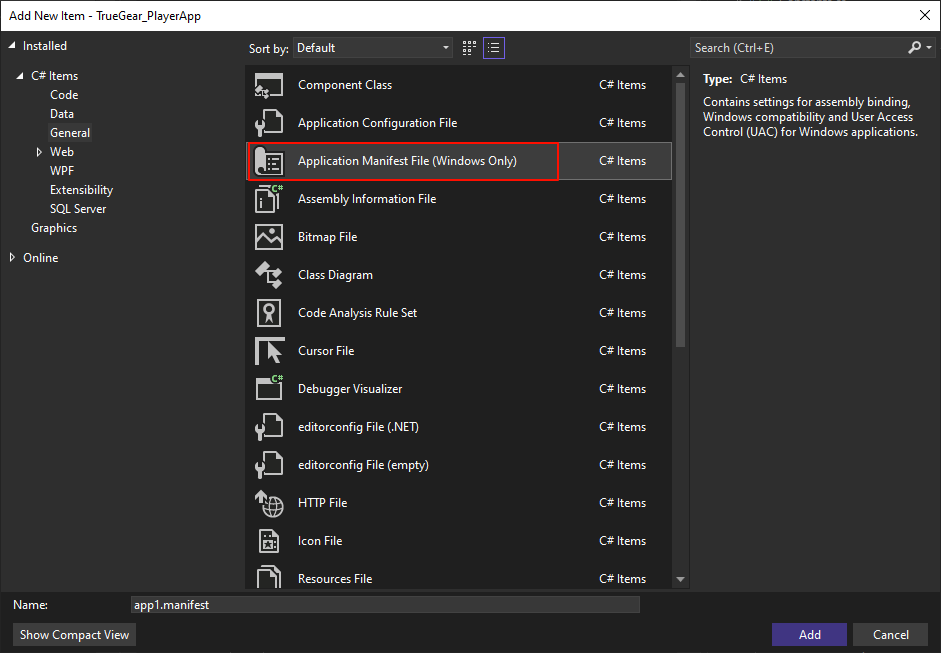

# Olyd.Wpf.DpiAutoScale

WPF应用程序，通过添加屏幕级别的DPI感知模式，结合`Viewbox`控件，实现不同DPI下，显示的实际分辨率相同的效果

> 注意：目前仅支持NoResize的窗体

## 使用步骤

1. WPF项目添加 `app.manifest`，并打开DPI感知模式



```xml {.line-numbers}
 <!-- 将以下代码复制到 app.manifest 文件中 -->
 <application xmlns="urn:schemas-microsoft-com:asm.v3">
  <windowsSettings>
   <dpiAwareness xmlns="http://schemas.microsoft.com/SMI/2016/WindowsSettings">PerMonitorV2</dpiAwareness>
   <dpiAware xmlns="http://schemas.microsoft.com/SMI/2005/WindowsSettings">true/pm</dpiAware>
  </windowsSettings>
 </application>
```

2. 窗体的Content必须是 `Viewbox`

```xaml {.line-numbers}
<Window>
    <Viewbox Stretch="UniformToFill">
    <!-- 实际显示控件 -->
    </Viewbox>
</Window>
```

3. Window 继承 `IAutoScale` 接口

> 需要提供 `ChildWidth` & `ChildHeight` & `ChildMargin` 具体值
> `Child` 和 `Window` 必须正确指向
> 实现 `RaiseDpiResized` 方法，可以在这里实现一些尺寸变化后的方法

4. Window 构造函数中调用 `this.InitAutoScale()` 方法
